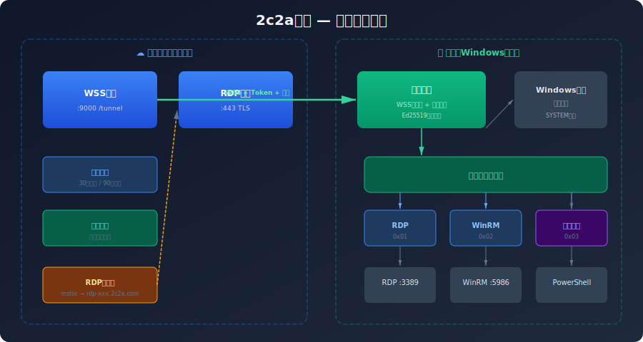
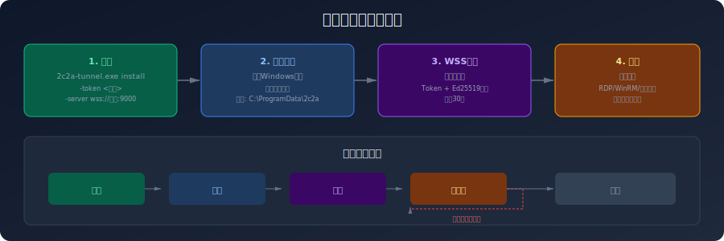

<div align="center">

<h1>ZASCA Tunnel</h1>

<p>
  <strong>边缘代理 — Windows 服务 + WSS 客户端 + 多路复用</strong><br>
  部署在被管 Windows 主机上的轻量级隧道代理
</p>

<p>
  
  
  
</p>

</div>

---

## 架构概览



zasca-tunnel 运行在被管的 Windows 主机上，通过 WSS 隧道连接到 Gateway，提供：

| 通道 | 代码 | 说明 |
|------|------|------|
| **RDP** | `0x01` | 转发到 `localhost:3389` |
| **WinRM** | `0x02` | 转发到 `localhost:5986` |
| **RemoteExec** | `0x03` | PowerShell 远程执行 |
| **Control** | `0xFF` | 心跳 + 控制信令 |

## 安装流程



### 安装为 Windows 服务

```bash
zasca-tunnel.exe install \
  -token <TOKEN> \
  -server wss://gateway.example.com:9000
```

安装后自动：
- 创建 Windows 服务（`ZASCA Edge Service`）
- 设置开机自启（`Auto Start`）
- 写入配置到 `C:\ProgramData\ZASCA\tunnel.yaml`
- 立即启动服务

### 查看版本

```bash
zasca-tunnel.exe version
```

### 卸载

```bash
zasca-tunnel.exe uninstall
```

## 项目结构

```
tunnel/
├── cmd/tunnel/
│   ├── main.go              # CLI 入口 (install/run/uninstall/version)
│   ├── install.go           # 安装逻辑
│   ├── run.go               # 运行服务
│   ├── client.go            # WSS 客户端 + 自动重连 + 心跳
│   ├── config.go            # YAML 配置
│   ├── remote_exec.go       # 远程 PowerShell 执行
│   ├── service_windows.go   # Windows 服务 API (build tag: windows)
│   └── service_other.go     # 非 Windows 桩文件
├── .github/workflows/
│   └── build-windows.yml    # CI/CD 自动打包
├── docs/
│   ├── architecture.svg     # 架构图
│   └── installation-flow.svg # 安装流程图
├── go.mod
└── go.sum
```

## CI/CD 自动打包

当推送 `tunnel/v*` 格式的 tag 时，GitHub Actions 自动构建：

```bash
git tag tunnel/v1.0.0
git push origin tunnel/v1.0.0
```

自动生成：
- `zasca-tunnel-windows-amd64.exe`
- `zasca-tunnel-windows-arm64.exe`
- `checksums-sha256.txt`
- GitHub Release（含版本说明）

## 安全特性

- **Ed25519 密钥交换**：每次连接自动生成临时密钥对，公钥发送给 Gateway
- **Token 认证**：每个主机使用唯一 Token，由 ZASCA 平台生成
- **TLS 加密**：WSS 连接全程 TLS 加密
- **签名验证**：RemoteExec 支持命令签名验证（防篡改）
- **SYSTEM 权限**：以 Windows 服务运行，拥有完整系统权限

## 设计要点

- **自动重连**：指数退避策略（1s → 2s → 4s → ... → 60s max）
- **心跳保活**：30s 间隔发送 Control 帧，90s 超时
- **多路复用**：单条 WSS 连接承载 RDP/WinRM/RemoteExec 三种通道
- **纯静态编译**：`CGO_ENABLED=0`，无外部依赖

## 配置文件

`C:\ProgramData\ZASCA\tunnel.yaml`：

```yaml
token: "your-tunnel-token"
server: "wss://gateway.example.com:9000"
rdp_port: "127.0.0.1:3389"
winrm_port: "127.0.0.1:5986"
```

## 许可证

AGPL-3.0 License - 查看 [LICENSE](LICENSE) 文件了解详情。
